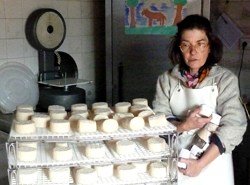

The small world of Roberta Di Tomassi under the Alps, just beyond Villar Pellice. She lives by choice in a hamlet of Borgata Maussa that she herself has brought back to life. She raises animals, makes cheese, single-handedly raised 4 children and now is betting on agriturismo.

Roberta Di Tomassi peeks out from her laboratory, alerted by the barking of dogs. To reach her Mountain Agricultural Company in the Mausset hamlet of Borgata Maussa at the foot of the Alps, you take a dirt road when the houses of Villar Pellice are already thinning out, following a hand-written sign on a wooden board suspended among the trees.
Roberta is a petite woman, fragile at first glance, but actually strong enough to single-handedly bring life back to an abandoned hamlet in Val Pellice. She now lives here with Nadine, one of her daughters who decided to follow in the footsteps of this determined mother, and their few animals: ten sheep and twenty goats, from which they produce excellent cheese.

A free spirit from a young age and in search of a "rustic life, pure air and water," she leaves Rome at sixteen to begin her experience with farming in an agricultural community in the French Ardèche, "where I hitchhiked from Paris on an unforgettable full moon night." There, along with nine other young people with the same passion, she discovers goats, the animal that conquers her heart and will accompany her throughout her life; she also learns to make bread, to work the land and produce cheese: "After the evening milking we heated the milk, put it in earthenware containers and during the night we took turns, keeping the fireplace lit, slowly rotating the container so it would heat evenly and the curds would set."

Back in Italy with the French experience still fresh in her eyes, Roberta decides to "open a place where people who live in the mountains and countryside can gather," where they could exchange goods and advice: thus was born the Bistro of Torre Pellice, a historic establishment that still exists today. Various circumstances take her away from Val Pellice, bringing her to Turin, but the call of the mountains is too strong, and she returns shortly after. Here she meets Jean, her future husband, with whom she shares the same passion for a healthy life, made of hard but genuine work and strong principles, which will lead her to Borgata Maussa. "When I came here for the first time with Jean, I looked out the window and knew I had found my anchor," she confides.
Looking out the same window you understand what she must have felt. The entire valley is at your feet, you only hear the sound of water "sometimes almost too loud," says Roberta. The mountains are so close you could touch them with your finger, the peaks still abundantly snowy.

But let's go back to 1983, she and Jean begin their life in the hamlet selling honey, wild fruit jams, bread and pastries baked in a wood-fired oven, vegetables and herbs at various markets "but no animals, until one day, for my birthday, Jean, knowing my passion, gave me the first three little goats." They raise four children and gradually acquire the entire hamlet: "At that time we were looked at a bit strangely by others, because we both already had a strong sensitivity to clean, organic and natural foods, while people were not yet ready for this way of thinking."
At 44 years old, Roberta suddenly finds herself alone with her small children, faced with a choice: either give up everything and move to town looking for other work, or select the activities to carry on independently and stay in the hamlet. But she has no doubts: "by now this was my work and this was the life I had chosen"; and when it comes to deciding which activity to continue, she obviously doesn't abandon her goats: "First love is never forgotten."

She tells her story while finishing labeling the cheese, feeding the young goats and beginning to prepare for milking, without stopping for a moment. The few goats are out on a small meadow, seemingly dozing, but they sense when Roberta is about to approach, recognizing her step and her voice.
No longer able to follow the markets, Roberta now sells her products directly to some shops and notable restaurants in the area. She has always produced various types of cheese: goat cheeses with juniper, with chestnut and vine leaves, covered with black pepper, with chili pepper, with Mexican chili and walnuts; and then there is ricotta, and other fancy cheeses like sesamina, luna caprese and goat's kiss. In her work she respects the biological rhythms of the goats, follows traditional recipes, choosing only natural ingredients. The forage with which she feeds her goats is free from pesticides and not contaminated by pollution, allowing her to have good and clean milk and cheeses.

"The other great adventure now is agriturismo, where I hope many people can enjoy healthy tranquility, learn to appreciate our mountains, come into contact with animals and perhaps learn to make cheese," she says, showing the just-completed rooms that can accommodate up to nine people: "Jean and I already wanted to open an agriturismo, but unfortunately it was not possible to do so earlier." Attentive to environmental respect, Roberta has installed solar panels on the roofs of the huts, making the hamlet completely self-sufficient from an energy perspective.
This is one of those encounters that leaves you smiling, that makes you understand how essential willpower is in life's choices, even when things don't go as hoped. Roberta's determination and desire to travel brought her to this small hamlet of Val Pellice, where she managed, despite everything, to realize her dream: a hut in the mountains, with her little goats and her family.

