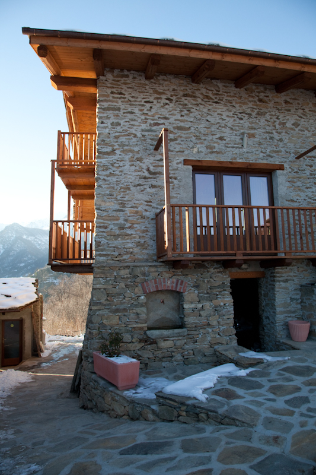
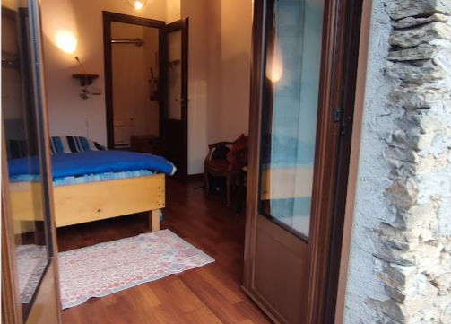
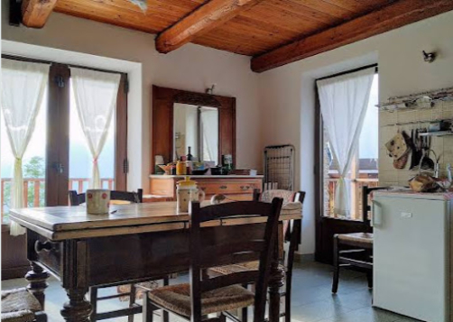

## Camere in Agriturismo in Val Pellice

La Stanza dei Nonni, il soppalco dei Gatti, il Fienile Grosso, la Camera di Magna Marianna… qui a Mausset ogni camera ha il suo nome, la sua personalità, un suo stile.

### Servizi Disponibili

A disposizione degli ospiti:
- Due cucine attrezzate
- Pompa di calore
- Frigorifero
- TV (nel Fienile Grosso)
- Balconi
- Connessione Internet (nel Fienile Grosso)

### Informazioni Importanti

È indispensabile la prenotazione con qualche giorno di preavviso soprattutto nel periodo invernale poiché gli ambienti devono essere riscaldati adeguatamente. A causa di ciò in inverno si applica la tariffa più alta.

L'importo è calcolato in base alla stanza scelta non al numero di persone che la occupano.

### Le Nostre Camere

| Stanza | Descrizione |
|--------|------------|
| **Stanza dei Nonni** | Camera doppia con cucina |
| **Soppalco dei Gatti** | Soppalco per ospiti aggiuntivi o zona relax |
| **Fienile Grosso** | Locale per riunioni, corsi, dormitorio |
| **Magna Marianna** | Camera matrimoniale in agriturismo |

---

<a href="/about.html#top" title="Filosofia"><b><< INDIETRO</b></a> &#124; <a href="/prodotti.html#top" title="Prodotti"><b>AVANTI >></b></a>
